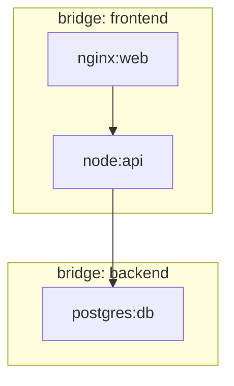

# Lesson 0: Docker Networking Fundamentals

Bridge your DevOps knowledge to network-specific concepts.

## Objectives

By the end of this lesson, you will be able to:

- [ ] Explain Docker network drivers and when to use each
- [ ] Create and manage Docker networks
- [ ] Understand how containers communicate
- [ ] Inspect network configuration for troubleshooting
- [ ] Use Docker Compose to define networks

## Prerequisites

- Docker installed and running
- Basic Docker command experience (run, ps, exec)
- Linux command line familiarity

## Video Outline

### 1. Why Docker Networking Matters (2 min)

- Containers need to communicate
- Different isolation requirements
- Foundation for Kubernetes networking
- Foundation for containerlab

### 2. Network Drivers Overview (3 min)

| Driver | Use Case |
|--------|----------|
| `bridge` | Default, isolated container networks |
| `host` | Container uses host network directly |
| `none` | Complete network isolation |
| `macvlan` | Container gets real MAC address |
| `overlay` | Multi-host communication |

### 3. Bridge Networks Deep Dive (4 min)

```bash
# Default bridge
docker network ls
docker network inspect bridge

# Custom bridge
docker network create mynet
docker run -d --name web --network mynet nginx
docker run -d --name db --network mynet postgres
```

- Custom bridges provide DNS resolution by container name
- Default bridge only provides IP-based communication
- Demonstrate container-to-container communication

### 4. Network Namespaces (3 min)

```bash
# View container's network namespace
docker inspect --format='{{.NetworkSettings.SandboxKey}}' container_name

# Container has isolated:
# - Interfaces
# - Routes
# - iptables rules
```

### 5. Port Mapping and Exposure (2 min)

```bash
# Publish port
docker run -d -p 8080:80 nginx

# Publish to specific interface
docker run -d -p 127.0.0.1:8080:80 nginx
```

### 6. Docker Compose Networking (3 min)

```yaml
version: "3.8"
services:
  web:
    image: nginx
    networks:
      - frontend
  api:
    image: node
    networks:
      - frontend
      - backend
  db:
    image: postgres
    networks:
      - backend

networks:
  frontend:
  backend:
```

### 7. Inspecting and Debugging (2 min)

```bash
# Network details
docker network inspect mynet

# Container network settings
docker inspect web --format='{{json .NetworkSettings}}' | jq

# Test connectivity
docker exec web ping db
```

## Lab Topology



## Key Concepts

### Network Isolation

- Containers on different networks cannot communicate (by default)
- This is similar to VLANs in traditional networking
- Containers can be connected to multiple networks

### DNS Resolution

- Custom bridge networks provide automatic DNS
- `ping db` works from `api` container
- Container name = hostname

### The Container Network Model (CNM)

Docker's networking architecture:
1. **Sandbox** - Network namespace with interfaces
2. **Endpoint** - Virtual ethernet connecting sandbox to network
3. **Network** - Group of endpoints that can communicate

## Exercises

Complete the exercises in [exercises/README.md](exercises/README.md).

## What's Next

Now that you understand Docker networking, you're ready for [Lesson 1: Containerlab Primer](../01-containerlab-primer/) where we'll use these concepts to run network operating systems in containers.

## Additional Resources

- [Docker Networking Overview](https://docs.docker.com/network/)
- [Docker Compose Networking](https://docs.docker.com/compose/networking/)
- [Network Namespace Deep Dive](https://man7.org/linux/man-pages/man7/network_namespaces.7.html)
