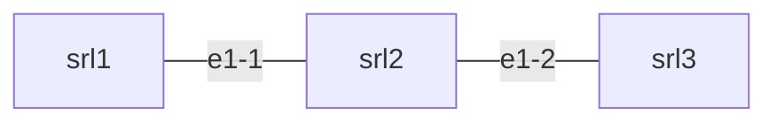
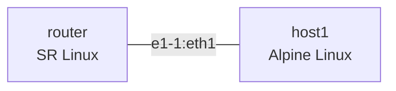

# Lesson 1 Exercises: Containerlab Primer

Complete these exercises to solidify your containerlab skills.

## Exercise 1: Deploy and Explore

**Objective:** Deploy the lab topology and explore the running environment.

### Steps

1. Deploy the provided topology:
   ```bash
   containerlab deploy -t topology/lab.clab.yml
   ```

2. Inspect the running lab:
   ```bash
   containerlab inspect -t topology/lab.clab.yml
   ```

3. Connect to `srl1` and explore:
   ```bash
   docker exec -it clab-first-lab-srl1 sr_cli
   ```

4. Run these commands inside SR Linux and record the output:
   ```
   show version
   show interface brief
   show system information
   ```

5. Exit and connect to `srl2`, verify it's also running:
   ```bash
   docker exec -it clab-first-lab-srl2 sr_cli
   ```

### Deliverables

Create a file `exercises/exercise1-output.md` with:
- Output of `containerlab inspect`
- SR Linux version from `show version`
- List of interfaces from `show interface brief`

---

## Exercise 2: Modify the Topology

**Objective:** Add a third node to the topology.

### Steps

1. First, destroy the current lab:
   ```bash
   containerlab destroy -t topology/lab.clab.yml
   ```

2. Create a new topology file `exercises/three-node.clab.yml` with:
   - Three SR Linux nodes: `srl1`, `srl2`, `srl3`
   - Linear connectivity: srl1 -- srl2 -- srl3
   - Use interface `e1-1` for srl1-srl2 link
   - Use interface `e1-2` for srl2-srl3 link

3. Deploy your topology:
   ```bash
   containerlab deploy -t exercises/three-node.clab.yml
   ```

4. Verify all three nodes are running:
   ```bash
   containerlab inspect -t exercises/three-node.clab.yml
   ```

5. Connect to `srl2` and verify it has two interfaces connected:
   ```bash
   docker exec -it clab-<your-lab-name>-srl2 sr_cli
   show interface brief
   ```

### Topology Diagram

Your topology should look like:



### Deliverables

- File: `exercises/three-node.clab.yml`
- Verify: `srl2` shows both `ethernet-1/1` and `ethernet-1/2`

---

## Exercise 3: Generate Documentation

**Objective:** Generate and save a topology graph.

### Steps

1. With your three-node lab running, generate the graph:
   ```bash
   containerlab graph -t exercises/three-node.clab.yml -o exercises/topology.png
   ```

   If the above doesn't work (no GUI), try:
   ```bash
   containerlab graph -t exercises/three-node.clab.yml --drawio
   ```

2. Take a screenshot or save the output

3. Also try the inspect output in different formats:
   ```bash
   containerlab inspect -t exercises/three-node.clab.yml --format json > exercises/lab-info.json
   ```

### Deliverables

- `exercises/topology.png` or screenshot
- `exercises/lab-info.json`

---

## Exercise 4: Find Resources

**Objective:** Navigate containerlab documentation and community.

### Steps

1. **Documentation:** Find the containerlab documentation page for SR Linux and note:
   - What startup configuration options are available?
   - How do you specify a license file (if needed)?

2. **GitHub:** Search GitHub for "containerlab" topic and find:
   - One repository with an interesting lab topology
   - Note the repo URL and what the lab demonstrates

3. **Community:** Visit the containerlab Discord (link in docs) and:
   - Note one recent question asked by a user
   - Find the channel for lab examples

### Deliverables

Create `exercises/resources.md` with:
- Link to SR Linux documentation page
- Link to an interesting community lab repo with brief description
- One observation from the Discord community

---

## Exercise 5: Challenge - Add a Linux Host

**Objective:** Create a topology mixing network OS and Linux containers.

### Steps

1. Create `exercises/mixed-topology.clab.yml` with:
   - One SR Linux node (`router`)
   - One Alpine Linux host (`host1`)
   - Connected via router's `e1-1` and host's `eth1`

2. Use this for the Linux node:
   ```yaml
   host1:
     kind: linux
     image: alpine:latest
   ```

3. Deploy and verify both containers are running

4. Connect to the host:
   ```bash
   docker exec -it clab-<lab>-host1 sh
   ```

5. Inside the host, verify the interface exists:
   ```bash
   ip addr show eth1
   ```

### Topology



### Deliverables

- `exercises/mixed-topology.clab.yml`
- Verification that `eth1` exists in the Alpine container

---

## Cleanup

After completing all exercises:

```bash
# Destroy any running labs
containerlab destroy --all

# Verify
docker ps | grep clab
```

## Validation

Run the automated tests:

```bash
pytest tests/ -v
```

## Completion Checklist

- [ ] Exercise 1: Deployed and explored the two-node lab
- [ ] Exercise 2: Created and deployed three-node topology
- [ ] Exercise 3: Generated topology graph and JSON output
- [ ] Exercise 4: Found documentation and community resources
- [ ] Exercise 5: Created mixed network/Linux topology

## Next Steps

Commit your exercises to your fork and proceed to [Lesson 2: IP Fundamentals](../02-ip-fundamentals/).
